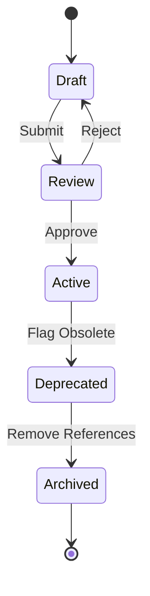

# Content Lifecycle Model (NV-300-M8)

## 1. Executive Assessment
*   **Status:** `NV-300-M8 COMPLETE`
*   **Decision:** `APPROVE CANONICAL CONTENT LIFECYCLE MODEL`
*   **Purpose:** Governs the states a content item transitions through from creation to final archiving to preserve referential stability.

---

## 2. Canonical Lifecycle States
Every `ContentItem` exists in one of five explicit states:

```text
Draft
    ↓
Review
    ↓
Active
    ↓
Deprecated
    ↓
Archived
```

### States:
1.  **Draft:** Work-in-progress content. Visible only to author; excluded from public indexes.
2.  **Review:** Completed draft awaiting review. Undergoing taxonomy validation.
3.  **Active:** Publicly available, indexed, and consumable by any `LearningPath`.
4.  **Deprecated:** Flagged as obsolete. Remains readable for existing user progress records but should not be linked in new paths/modules.
5.  **Archived:** Permanently removed from active indexes. Physical file retained for progress database history.

---

## 3. Candidate Comparison Matrix

| Criteria | Immediate Deletion | State Flag (Approved) |
| :--- | :--- | :--- |
| **Referential Safety** | Poor (breaks learning paths) | **Excellent** (safe degradation) |
| **Index Overhead** | None | **Minimal** (filtered out in query) |
| **Authoring Undo** | Impossible | **Easy** (state transition change) |

---

## 4. Lifecycle Transitions



---

## 5. Deprecation & Archival Rules
*   An item cannot move from `Active` to `Archived` directly if active `LearningPath` modules still reference it. It must go to `Deprecated` first.
*   Once all paths remove references, a cron/script or Domain Lead transitions it to `Archived`.

---

## 6. Forbidden States
The following states are strictly **FORBIDDEN** from the NeuralVerse content lifecycle:
*   `Private` (redundant with `Draft`)
*   `Staged` (metadata checks are synchronous; no intermediate staging is needed)
*   `Suspended` (redundant with `Deprecated`)

---

## 7. Architectural Consequences
By forcing a state-driven lifecycle, the progress engine never encounters a "missing entity file" crash. If a user tries to load progress for a `Deprecated` or `Archived` item, the system loads a fallback message explaining that the item was retired, avoiding route errors.

---

## 8. Final Decision
> [!IMPORTANT]
> **Decision: APPROVE CANONICAL CONTENT LIFECYCLE MODEL**
>
> The Canonical Content Lifecycle Model is approved, enforcing strict transition paths and referential safety checks.
