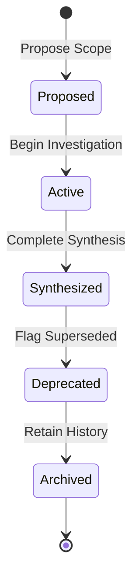

# Research Lifecycle Model (NV-400-M9)

## 1. Executive Assessment
*   **Milestone:** `NV-400-M9`
*   **Status:** `COMPLETE`
*   **Result:** `Research Lifecycle Model Defined`
*   **Decision:** `APPROVE` (Minimalist Lifecycle model)

---

## 2. Research Lifecycle State Model
To support evolutionary milestones without requiring workflow engines or pipeline scripts, `ResearchProjects` transition through five explicit states:

```text
Proposed (Research Intent)
    ↓
Active (Investigation & Analysis)
    ↓
Synthesized (Synthesis & Knowledge Candidate Proposal)
    ↓
Deprecated (Retired or Succeeded)
    ↓
Archived (Historical log)
```

### State Definitions:
1.  **Proposed:** Project scope is formulated, but execution has not begun.
2.  **Active:** Research is in progress. Raw findings are being generated.
3.  **Synthesized:** Research is complete. A summary document is published, and any resulting concepts are prepared as `Knowledge Candidates`.
4.  **Deprecated:** Project is superseded by newer research or is no longer relevant.
5.  **Archived:** Project is removed from active workspace lists but physically retained for reference integrity.

---

## 3. Entity Lifecycle Overview

| Entity | Required States | Allowed Transitions | Deprecation & Archival Rules |
| :--- | :--- | :--- | :--- |
| **ResearchArea** | Active, Deprecated | Active ➔ Deprecated | Cannot deprecate if active projects depend on it. |
| **ResearchTopic** | Active, Deprecated | Active ➔ Deprecated | Cannot deprecate if active projects depend on it. |
| **ResearchProject** | Proposed, Active, Synthesized, Deprecated, Archived | Linear flow (State Diagram below) | Deprecation requires synthesis completion. |
| **ResearchTheme** | Active, Archived | Active ➔ Archived | Archived when no active/proposed projects reference it. |
| **Tags** | Active, Archived | Active ➔ Archived | Handled dynamically via linter checks. |

---

## 4. Lifecycle Transition Rules



---

## 5. Research-to-Knowledge Transfer Boundary
*   **Research Phase:** All findings, logs, and drafts remain under the sole ownership of the `ResearchProject` (Research Governance Authority).
*   **Knowledge Candidate Phase:** When a project reaches the `Synthesized` state, specific outputs are flagged as `Knowledge Candidates`.
*   **Handover Boundary:** The `KnowledgeDomain` (Knowledge Governance Authority) reviews the candidates. Upon acceptance, the candidate is compiled into a canonical `ContentItem` under domain ownership. The original research project retains its historical reference log but ceases to own the content item.

---

## 6. Lifecycle Minimalism Review
*   **Required States:** `Active`, `Synthesized`, `Deprecated`.
*   **Recommended States:** `Proposed`, `Archived`.
*   **Optional States:** `Under-Review` (for multi-author consensus).
*   **Forbidden States:** `Scheduled` (no auto-gates), `Published` (redundant with `Synthesized`), `Staged-for-AI` (violates core decoupling rules).

---

## 7. Lifecycle Drift Analysis
*   **Lifecycle Drift:** Projects remaining in `Active` status indefinitely. *Mitigation: Auto-flag projects with no active logs in 6 months for review.*
*   **Ownership Drift:** Ownership boundaries blurring during knowledge transfer. *Mitigation: Require explicit metadata declaration when a Knowledge Candidate transitions into a ContentItem.*

---

## 8. Scalability Analysis
*   **100 Projects:** Easily managed using frontmatter metadata mapping.
*   **500 Projects:** Handled via simple filter queries in the workspace dashboard.
*   **1000+ Projects:** Scaled efficiently because the `Archived` state removes projects from active index loading loops, preserving memory and compilation speeds.

---

## 9. Final Decision
> [!IMPORTANT]
> **Decision: APPROVE CANONICAL RESEARCH LIFECYCLE MODEL**
>
> The Canonical Research Lifecycle Model is approved, specifying clean, lightweight state progression boundaries that prevent circular dependencies or resource leaks.

---

## 10. Next Milestone
### NV-400 (Research Workspace Final Review)
*   **Purpose:** Perform a complete architectural audit of Authority, Classification, Metadata, Workspace, Governance, and Lifecycle, and determine whether NV-400 can be considered architecturally complete.
