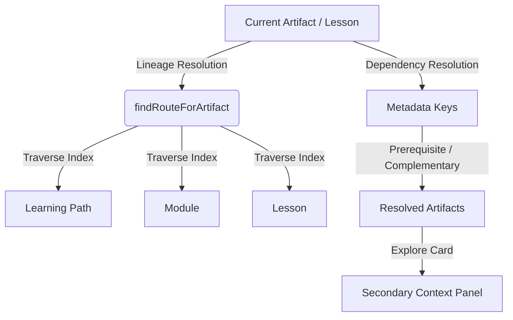

# NV-900-UI6 — Cross-Linking & Contextual Navigation Architecture

This document specifies the technical design, data resolution heuristics, layout structures, and verification suite for the deterministic cross-linking and contextual navigation layers across the NeuralVerse curriculum.

## 1. Objective

Implement a non-intrusive, context-aware navigation and cross-linking overlay that leverages existing metadata and structural hierarchies to expose relationships (parent, child, sibling, and metadata dependencies) without fabricating data or interrupting reading flow.

## 2. Core Architecture & Lineage-Aware Resolution

The navigation layer is entirely client-side, retrieving relationship data dynamically using the cached index and metadata schema from `curriculum-service.js`.

### 2.1 Parent Lineage Resolution (`findRouteForArtifact`)
To support deep linking and contextual links, we resolve the canonical lineage coordinates of any artifact:
$$\text{Artifact ID} \rightarrow (\text{Path ID}, \text{Module ID}, \text{Lesson ID})$$
This traversal is executed deterministically by checking containment in `path.artifactScope`, `module.artifactScope`, and `lesson.artifactIds` structures.

### 2.2 Sibling & Sibling-Adjacent Navigation
- **Artifact View**: Siblings are defined as other artifacts residing in the same parent lesson, excluding the active artifact.
- **Lesson View**: Sibling lessons are defined as the immediate predecessor and successor lessons within the current module.
- **Module View**: Sibling modules are defined as predecessor/successor modules in the current learning path.

### 2.3 Metadata Dependency Resolution
If defined in the parsed frontmatter of the markdown artifact:
- `prerequisite`: Must be completed before the active artifact.
- `complementary`: Related content covering adjacent topics.
- `recommended_before` / `recommended_after`: Recommended sequential ordering.
- `alternative`: Alternative presentation of the same competencies.

---

## 3. UI/UX Layout Integration

Contextual panels are rendered as secondary elements in the reading flow to prevent visually dominant sidebars from interrupting the reading experience.

### 3.1 Layout Flow on Artifact Pages
1. **Main Reading Content**: Markdown reader panel (`.nv-curriculum-reader`).
2. **Contextual Navigation Section** (`.nv-cross-links-section`):
   - **Lineage Trail** (`.nv-part-of-trail`): Displays `Path → Module → Lesson` breadcrumbs.
   - **Sibling / Dependency Card Grid** (`.nv-cross-links-grid`): Displays entity cards containing kickers, titles, descriptions, status badges, and explore affordances.
3. **Navigation Footer** (`.nv-lesson-workspace__navigation`): Displays Prev/Next buttons.

---

## 4. Verification Suite

Verification is automated using Playwright in headless Chromium, implemented in `scripts/nv-900-ui6-verify.js`. It performs the following checks:
1. **Breadcrumb Trail visibility and length** in Artifact View.
2. **Contextual grid presence** and card metadata structure (Kicker, Title, Status, Action Button).
3. **Previous/Next Sibling Lesson cards** in Lesson View.
4. **Parent Path & Sibling Module cards** in Module View.
5. **Successful Navigation Flow** when clicking card action links.
6. **Zero console errors** captured during page transitions.
