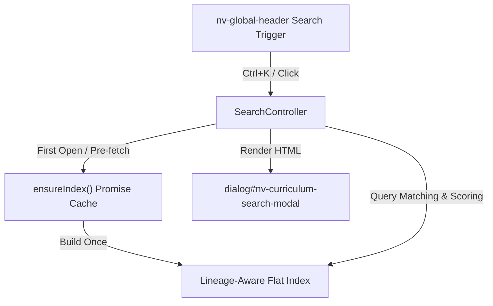

# NV-900-UI5: Global Search & Knowledge Discovery

## Objective
Implement a client-side global curriculum search to help learners and maintainers discover Learning Paths, Modules, Lessons, and Specific Artifacts.

## Architecture

The search index is flattened and normalized once from `curriculum-index.json`. The controller uses a promise-based pre-fetching mechanism to load the index asynchronously and cache it, preventing redundant network requests.

## Key Subsystems

### 1. Weighted Relevance Ranking
Results are matches on the query text, sorted by relevance score:
* **Exact Title Match**: `1000` points
* **Prefix Title Match**: `800` points
* **Substring Title Match**: `600` points
* **Whole-word Title Match**: `500` points
* **Summary Match**: `400` or `300` points
* **ID / Tag Match**: `200` points
* **Metadata Match**: `100` points

### 2. Punctuation & Diacritic Normalization
Both query inputs and indexed content are normalized:
* Diacritics are removed (e.g. `relação` -> `relacao`).
* Standard punctuation symbols (`.`, `,`, `/`, `?`, `!`, `;`, `:`) are stripped out.
* Hyphenations and technical terms containing special symbols like `C++`, `C#`, and `self-attention` are preserved to retain matching integrity.

### 3. Accessible Dialog & Keyboard Shortcuts
Fully accessible keyboard routing has been implemented:
* **`Ctrl + K`**: Globally toggles search modal.
* **`ArrowDown / ArrowUp`**: Navigates search results.
* **`Home / End`**: Jumps to first / last search result.
* **`Enter`**: Navigates to active route.
* **`Ctrl + Enter`**: Opens active route in a new tab.
* **`Escape`**: Closes modal and restores focus to header search trigger.
* **Focus Trapping**: Tabs cycle exclusively inside the modal container.

### 4. Smart Empty State & Suggestions
When search queries yield no results, suggestion buttons (`embeddings`, `transformer`, `reranking`, `guardrail`, `MLOps`) are rendered. Clicking any suggestion updates the input value and runs the query immediately.
