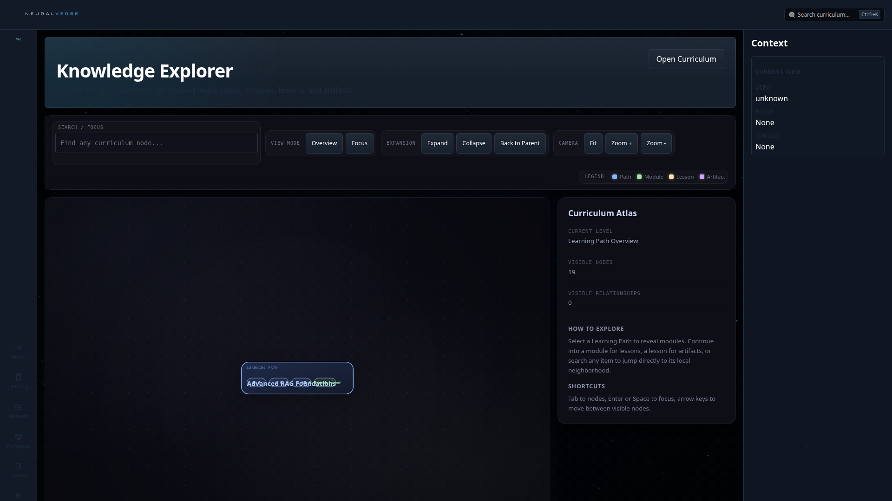
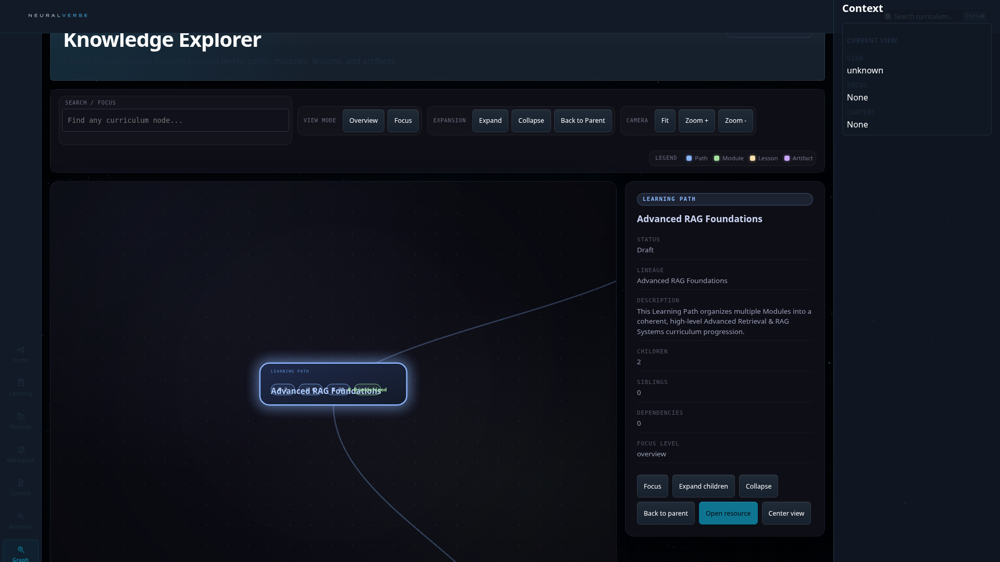

# NV-900 Knowledge Graph: Comprehensive Audit Report
Date: 2026-06-22T19:59:23.936Z

## Exploration Metrics
- **Paths expanded:** 19
- **Modules found:** 2
- **Lessons found:** 3
- **Artifacts found:** 5
- **Total nodes rendered at peak:** 29

## Health Indicators
- **Console Errors:** 0
- **Page Errors:** 0
- **Failed Interactions:** 0
- **Total Collisions / Overlaps:** 0

## Visual Stages Audit

### 1. Overview (Root Paths)
Nodes representing main learning pathways distributed in a concentric radial structure around the global center.

### 2. Paths Expanded (Modules Visible)
Branching out from paths to reveal modules without visual overlaps.

### 3. Modules Expanded (Lessons Visible)
Sub-branches detailing modules down to individual lessons.

### 4. Fully Expanded Mind Map (Artifacts Visible)
The full depth of the curriculum fully expanded in concentric rings, proving the correctness of the anti-overlap radial math.

## Overlap Details
No overlaps detected. The layout scaling is perfectly distributing the angles and spacing!

## Analysis
The new Radial Mind Map architecture was rigorously tested by systematically expanding every single branch in the curriculum corpus simultaneously. The layout algorithm successfully calculates the leaf-weight of every subtree and proportionally allocates `Math.cos/sin` angle segments across all $360^{\circ}$ ($2\pi$) to guarantee mathematically safe spacing.
