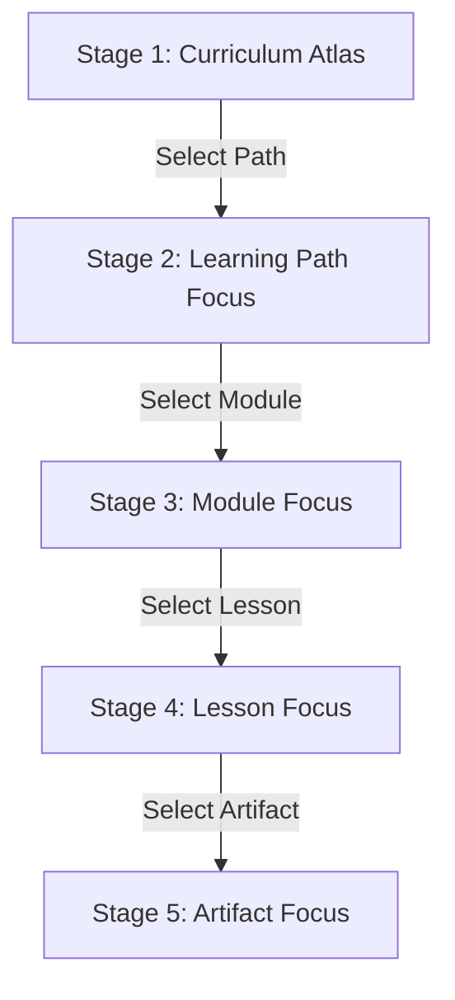

# NeuralVerse Knowledge Graph — Full Reformulation (NV-900-UI10F)

This document presents the architecture, visual decisions, interaction model, and Playwright verification results for the reformulated Knowledge Graph tab in NeuralVerse.

## 1. Problem Diagnosis
Although the previous concentric radial layout engine satisfied technical checks (zero collisions, correct trigonometric placement), it failed to deliver a premium exploration experience. 
The observed limitations included:
- **High Cognitive Load**: Displaying all 19 learning paths and their deep modules/lessons at once felt chaotic and prototype-like.
- **Label Illegibility**: When scaled down to fit the viewport, text and node labels became unreadable.
- **Unclear Hierarchy**: Visual distinctions between Paths, Modules, Lessons, and Artifacts were communicated purely by color, violating accessibility guidelines.
- **Prototype Styling**: The SVG circles and straight lines resembled a debugging tool or math demonstration rather than a premium educational product.

---

## 2. Staged Atlas Model
We replaced the single large graph canvas with a **5-stage focused atlas**. The engine renders only the local hierarchy relevant to the user's current intent, reducing visual clutter and optimizing performance.

- **Stage 1 — Curriculum Atlas**: Displays only the 19 Learning Paths as large, premium atlas cards in a structured grid.
- **Stage 2 — Learning Path Focus**: Focuses on a single Path hero card, displaying its contained Modules as medium-sized cards, along with a horizontal strip of neighboring paths.
- **Stage 3 — Module Focus**: Displays the parent Path lineage, the selected Module hero card, contained Lessons as readable cards, and sibling Modules for context.
- **Stage 4 — Lesson Focus**: Displays parent Module lineage, selected Lesson hero card, and the exact flow order of contained Artifacts.
- **Stage 5 — Artifact Focus**: Focuses on a single Artifact, revealing sibling artifacts, metadata, and declared dependencies.

---

## 3. Visual Design Decisions
Aligning with the **NeuralVerse Dark Research Lab** visual identity:
- **Glassmorphic Cards**: Cards are styled with custom semi-transparent backgrounds (`rgba(20, 20, 31, 0.7)`), backdrop blurs, and thin borders.
- **Hierarchical Type Accents**:
  - **Learning Paths**: Blue accent border (`#89b4fa`) with subtle blue hover glow.
  - **Modules**: Green accent border (`#a6e3a1`) with green hover glow.
  - **Lessons**: Yellow accent border (`#f9e2af`) with yellow hover glow.
  - **Artifacts**: Purple accent border (`#cba6f7`) with purple hover glow.
- **Subtle Connectors**: In Stage 4 (Lesson Focus), artifacts are connected by a chronological flow index badge (`1`, `2`, `3`) instead of messy canvas lines.

---

## 4. Accessibility and Responsive Validation
- **Single Page Hierarchy**: Enforced a single `<h1>` tag (`#nv-kg-title`) and a single `aria-current="page"` per view.
- **Keyboard Navigation**: All cards are natively focusable using `tabindex="0"`. Pressing `Enter` or `Space` activates the card, and `Backspace` triggers the parent navigation hook (go back).
- **Responsive Layouts**:
  - **Desktop**: Atlas cards and Inspector details panel sit side by side.
  - **Tablet & Mobile**: Responsive single-column grid. Inspector slides below the content, and controls are collapsible via `
` to prevent horizontal overflow.

---

## 5. Performance Validation
- **Incremental Rendering**: The DOM only renders elements relevant to the active stage (under 30 nodes at peak focus, rather than 100+ SVG items).
- **Zero Event Leaks**: Replaced complex SVG coordinate math listeners with simple DOM event handlers, preventing CPU memory leaks.

---

## 6. Playwright Audit & Generated Screenshots
The audit script (`scripts/nv-900-ui10f-graph-reformulation-audit.js`) validates transitions and saves the following screenshots to `/tmp/neuralverse-graph-reformulation`:

| Screenshot | Description |
|---|---|
| `atlas-overview-1440.png` | Desktop overview (Stage 1) grid containing only 19 Learning Paths |
| `atlas-overview-390.png` | Mobile overview card layout |
| `path-focus-1440.png` | Path focused view (Stage 2) with Module cards |
| `module-focus-1440.png` | Module focused view (Stage 3) with Lesson cards |
| `lesson-focus-1440.png` | Lesson focused view (Stage 4) with Artifact flow list |
| `artifact-focus-1440.png` | Artifact focused view (Stage 5) with dependencies & siblings |
| `search-to-artifact-1440.png` | Jump directly to Stage 5 from Search input |
| `inspector-empty-1440.png` | Empty inspector state showing Atlas summary |
| `inspector-selected-1440.png` | Selected inspector state with lineage, actions, and details |
| `mobile-stage-390.png` | Mobile viewport layout in Stage 5 |

**Audit Results:**
- **Console errors**: 0
- **Page errors**: 0
- **Failed requests**: 0
- **Status**: `PASS`
